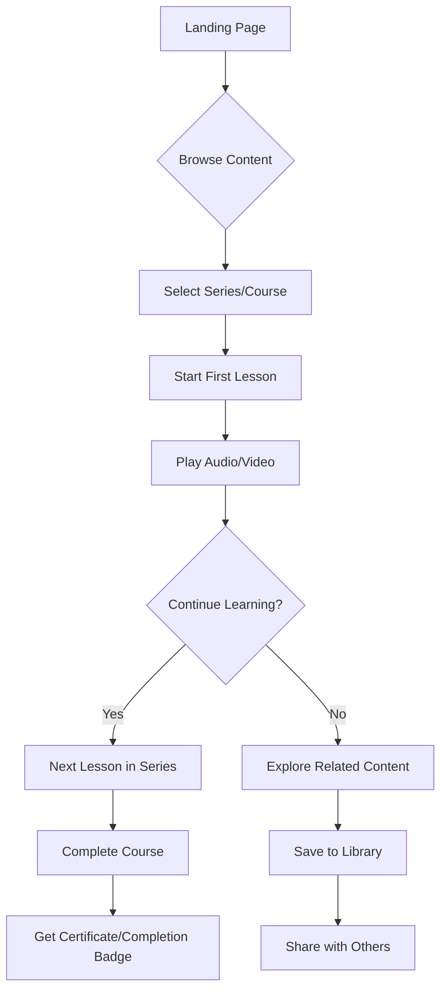
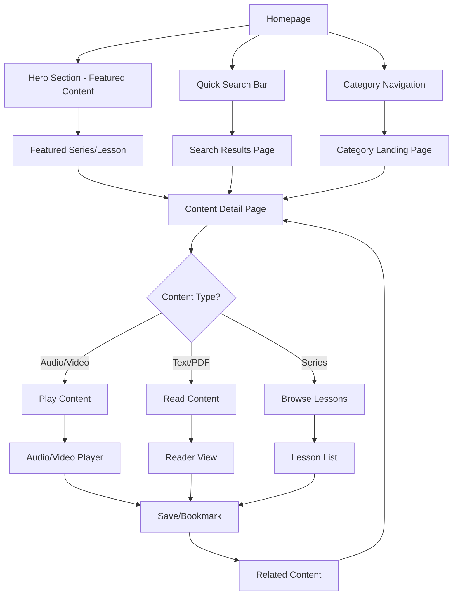
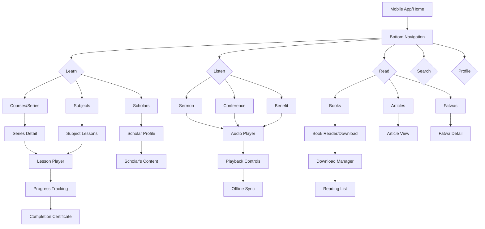
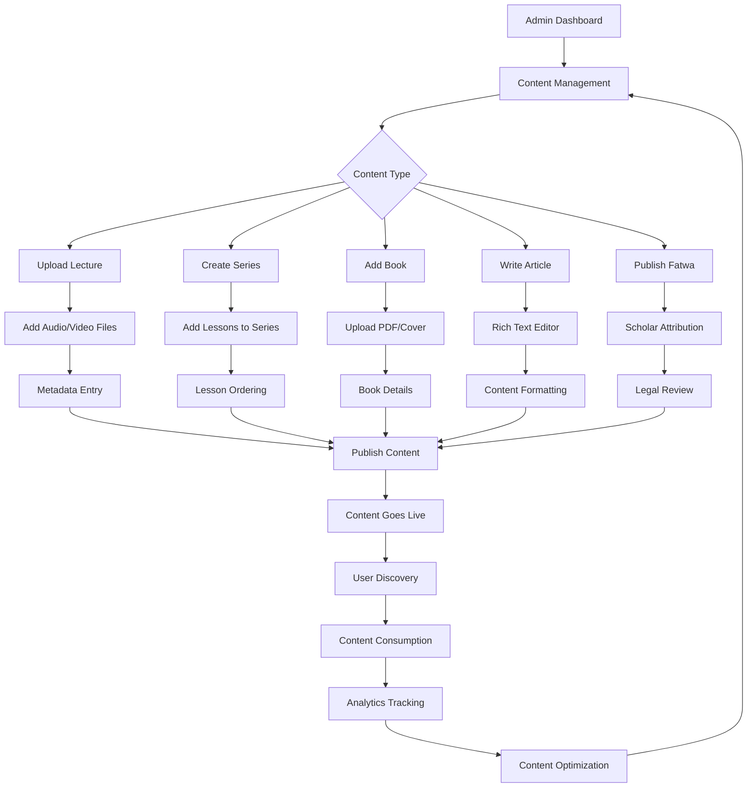
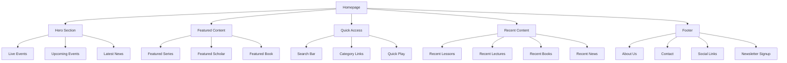
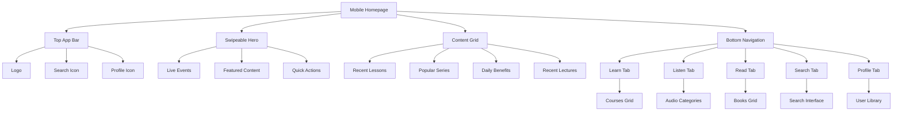

# User Flow Diagrams for Al-Maktabah

## Primary User Journey: New User Onboarding

## Content Discovery Flow

## Mobile Navigation Flow

## Information Architecture

```mermaid
graph TD
    A[Al-Maktabah Platform] --> B[Learn]
    A --> C[Listen]
    A --> D[Read]
    A --> E[Community]
    A --> F[Search]

    B --> G[Courses/Series]
    B --> H[Scholars]
    B --> I[Subjects]

    G --> J[Quran Studies]
    G --> K[Aqeedah]
    G --> L[Hadith]
    G --> M[Fiqh]
    G --> N[Seerah]
    G --> O[Arabic Language]

    H --> P[Scholar Profiles]
    H --> Q[Scholar Content]

    I --> R[Subject Categories]
    I --> S[Difficulty Levels]

    C --> T[Sermon]
    C --> U[Conference]
    C --> V[Benefit]

    T --> W[Recent Sermons]
    T --> X[Scholar Sermons]
    T --> Y[Topic Sermons]

    D --> Z[Books]
    D --> AA[Articles]
    D --> BB[Fatwas]

    Z --> CC[Quran]
    Z --> DD[Hadith Books]
    Z --> EE[Fiqh Texts]
    Z --> FF[Aqeedah]
    Z --> GG[Seerah]
    Z --> HH[Arabic Literature]

    E --> II[Scholars Directory]
    E --> JJ[Latest News]
    E --> KK[Events]

    F --> LL[Global Search]
    F --> MM[Advanced Filters]
    F --> NN[Search Suggestions]
```

## Content Management Flow (Admin)

## Page Structure Map

## Mobile Page Layout

These diagrams provide a comprehensive view of how users will navigate and interact with the Al-Maktabah platform. The flows emphasize:

1. **Progressive Disclosure**: Starting simple, revealing complexity as needed
2. **Content-First Approach**: Prioritizing content discovery and consumption
3. **Mobile-Optimized**: Touch-friendly interactions and swipe gestures
4. **Multi-Modal Learning**: Supporting audio, video, and text content types
5. **Community Building**: Connecting users with scholars and each other
6. **Personalization**: Adapting content based on user preferences and history
